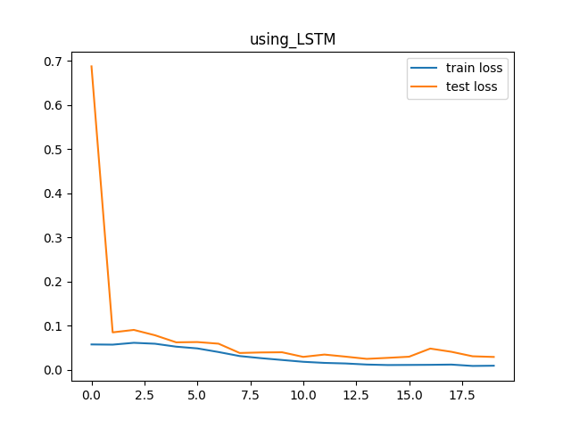
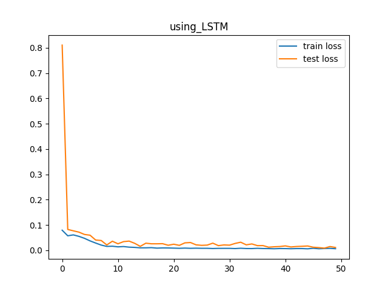
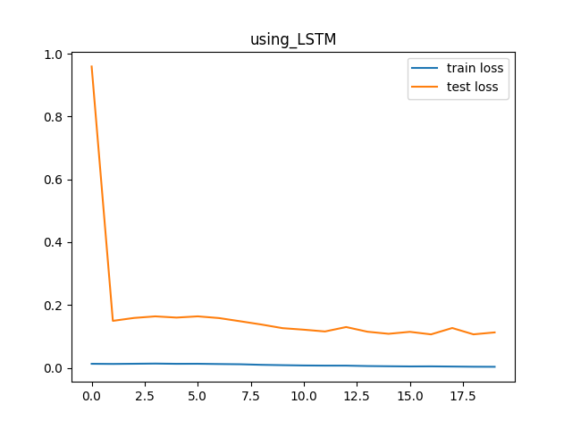
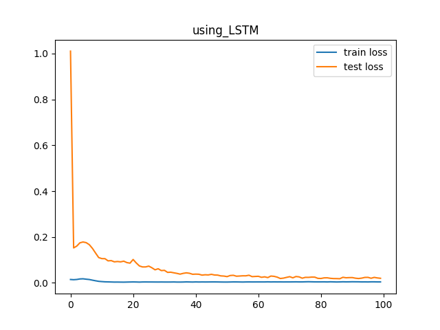

# Mini Projet de deep Learning

Dans le cadre du cours "Machine learning & differentiable programming" , il nous a été demandé de travailler par binome 
sur un mini projet qui a comme objectif d'entrainer un modèle sur un jeu de données connu et puis d'analyser les résultats.

Membres du groupe:
- HASSANE MAHAMANE Abdoul-Aziz
- CHANA Housna

Pour la réalisation de ce mini projet, voici les étapes qu'on a réalisées tout au long de ce mini projet:

1. Choix du jeu de données et étapes de preprocessing
2. Rappel sur le modèle choisi
3. Implémentation des codes
4. Analyse des résultats
5. Conclusion

## 1. Choix du jeu de données et différentes étapes de preprocessing :

Nous avons choisi le jeu de données "Stock quotidien dans les stockages de gaz" de la source "https://www.data.gouv.fr" . 
Il s'agit d'une grande base de données qui contient des données sur le débit quotidien des stockages de gaz à partir de 
novembre 2010 jusqu'à novembre 2022.

Nous avons décidé tout d'abord de passer par une étape primordiale qui est le nettoyage des données.
Notre objectif, c'est de prédire une valeur de stock de gaz en fin de journée en fonction de la valeur de ce stock 
pendant un certain nombre de jours précedant; Par exemple, prédire le stock d'un jour en fonction des stocks des 7 jours 
précedants. Ce nombre de jours est un paramètre qu'on peut modifier.
On s'est intéressé plus particulièrement aux données dont le pits* est "centre". En effet, sur le jeu de données qu'on a recuperé, 
il y a les stocks journaliers de plusieurs pits différents. Se concentrer sur un seul pits est justifié par le fait que si 
notre modèle fonctionne sur un pits, alors il fonctionnera pour n'importe lequel.

PITS (Point d'Interface Transport Stockage) = point d'enlèvement entre le réseau et un ou plusieurs centres de stockage de gaz

Les données étaient en désordre, il a fallu alors les trier dans l'ordre croissant des dates auxquelles chaque valeur a 
été recensée, puis on a filtré les données de telle sorte que la première expérience se fasse sur des données entre "2019-12-31" 
et 2021-1-1 (1 année), et pour la deuxième expérience, c'est entre "2017-12-31" et 2021-1-1 (3 années).

Il était judicieux de choisir des fenetres de temps car l'apprentissage sur toutes les doonnées disponibles prendrait beaucoup 
de temps vu les ressources limitées de nos ordinateurs.

Pour les deux expériences, on a choisi de faire la prédiction de la valeur de stock de gaz du 11ème jour en fonction des 10 jours précedants.

Pour chaque expérience alors, une fois le zoom fait sur le nombre d'années à utiliser, nous avons divisé notre jeu de données 
en 80% comme données allant servir à l'entrainement du modèle et les 20% restants sont reservés pour tester le modèle.

Enfin, nous avons fait appel à la fonction **MinMaxScaler** de la librairie **Scikit learn** pour normaliser ces données.

Cette étape est très importante car les modèles d'apprentissage fonctionnent mieux avec des données homogènes.

## 2. Rappel sur le modèle choisi :

Face à ce problème de prédiction en fonction d'un nombre de séquence (10 jours ou 30jours), nous avons décidé d'utiliser 
un modèle qu'on avait bien détaillé en cours qui est le modèle LSTM.
Pour rappel, la particularité des LSTM c'est qu'ils sont capables de modéliser des dépendances à très long terme. Ceci vient du fait qu'ils possèdent une mémoire interne appelée cellule (ou cell). Cette dernière permet de maintenir un état aussi longtemps que nécessaire. Cette cellule consiste en une valeur numérique que le réseau peut piloter en fonction des situations.

La cellule peut être pilotée par trois portes de contrôle, ou gates :

    1. gate d'entrée décide si l'entrée doit modifier le contenu de la cellule .

    2. gate d'oubli décide s'il faut remettre à 0 le contenu de la cellule .

    3. gate de sortie décide si le contenu de la cellule doit influer sur la sortie du neurone.

Notre modèle a été conçu avec 2 couches LSTM cachées suivi d'une couche linéaire en sortie du réseau.

## 3. Structure du code:

Pour l'implémentation du code, vous pouvez voir le fichier "main.py". On peut résumer cette implémentation par les points suivants :

    1. Importation du jeu de données

    2. Preprocessing du jeu de données

    3. Division du jeu de données en données d'entrainement et de test (80% et 20% respectivement)

    4. Définition de la fonction fenetre_glissante() : Celle-ci va donner la main à l'utilisateur de choisir le nombre de séquence qu'il souhaite. Du coup, ceci va nous permettre de distinguer entre les deux expériences mentionnées auparavant.

    5. Création de la classe PredicteurStockQuotidien(nn.Module) qui contient notre modèle LSTM

    6. Définition des fonctions train() et test()

## 4. Analyse des résultats :

### A) Première expérience : Prédiction de la valeur du stock au 11ème jour en fonction des 10 jours précédents.

A.a) Les courbes :

En lancant l'expérience:
On remarque que notre modèle résulte des courbes d'apprentissage de bon ajustement (Good Fit learning curves) et ceci 
s'explique par le fait que les deux courbes continuent à décroitre jusqu'à un point de stabilisation (ceci se voit mieux 
avec un nombre d'epochs de 50, voir image2). On remarque également qu'entre les deux courbes on trouve une marge, appelé souvent gap de généralisation qui fait référence à la capacité de votre modèle à s'adapter correctement à de nouvelles données qui n'étaient pas visibles au préalable.

En ce qui concerne notre modèle, on peut dire qu'il n'est pas trop stable contre ce qu'on appelle "data noise" parce que comme 
on le voit dans les résulats, la courbe de **test loss** ne decroit pas d'une facon souple.

A.b) Temps d'entrainement :

Avec le LSTM : en réalisant 5 expériences sur notre code, on a remarqué que le temps d'entrainement est entre 10s et 20s 
et que les courbes on été différentes pour chaque plot .Ce qui est normal car les LSTM sont stochastiques.

### B) Deuxième expérience :

On garde les mêmes valeurs pour les paramètres (nombre d'epochs, learning_rate, etc.)
B.a) Les curves :

En lancant l'expérience, on remarque que notre modèle résulte un modèle underfit et ceci s'explique par le fait que la test loss 
est presque 20fois supérieur que la train loss . On remarque également qu'entre les deux courbes on trouve une large marge.
On remarque que le noise persiste toujours dans notre modèle ce qui est normal puisque c'est dû a la nature du jeu de données.

B.b) Temps d'entrainement :

Avec le LSTM : en réalisant 5 expériences sur notre code, on a remarqué que le temps d'entrainement est entre 20s et 30s 
et que les courbes on été différentes pour chaque plot .Ce qui est normal car les LSTMS sont stochastiques.

Face à un modèle underfit, on avait pensé cette fois-ci à augmenter le temps d'entrainement en augmentant le nombre d'epochs. 

On remarque alors qu'on peut éviter l'underfitting en trouvant un nombre idéal comme nombre d'epoch ; dans notre cas c'était pour 100 epochs.
Bien évidemment, avec un nombre aussi grand le temps d'entrainement était plus conséquent.

## Conclusion :

Ce mini projet nous a vraiment aidé à appliquer les notions du cours que nous avons vu. Aujourd'hui on est plus à l'aise 
voire capable de passer par les différentes étapes pour analyser et prendre le recul sur les modèles du deep learning qu'on choisit. 
C'est une occasion également pour revoir plusieurs notions et comprendre les différentes courbes, paramètres et hyperparamètres utilisés dans ce cadre.
Sans oublier que grâce a ce cours, on a pu améliorer notre manière d'écrire et déposer les codes sur github.

## Bibliographie :

Pour la réalisation de ce travail, on s'est appuyé sur les ressources suivantes :

https://www.data.gouv.fr/fr/datasets/stock-quotidien-dans-les-stockages-de-gaz-a-partir-de-novembre-2010/
https://members.loria.fr/CCerisara/#courses/machine_learning/
https://machinelearningmastery.com/learning-curves-for-diagnosing-machine-learning-model-performance/
